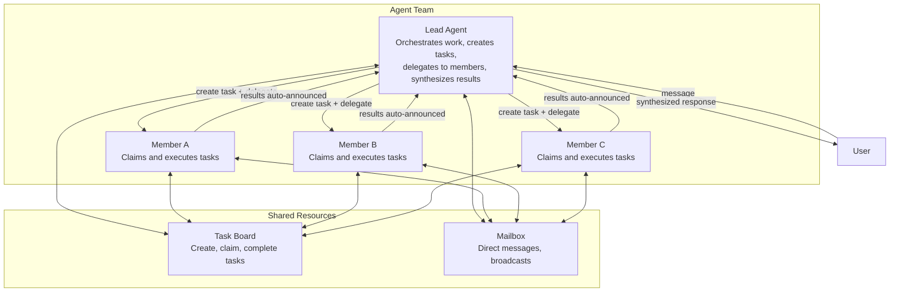
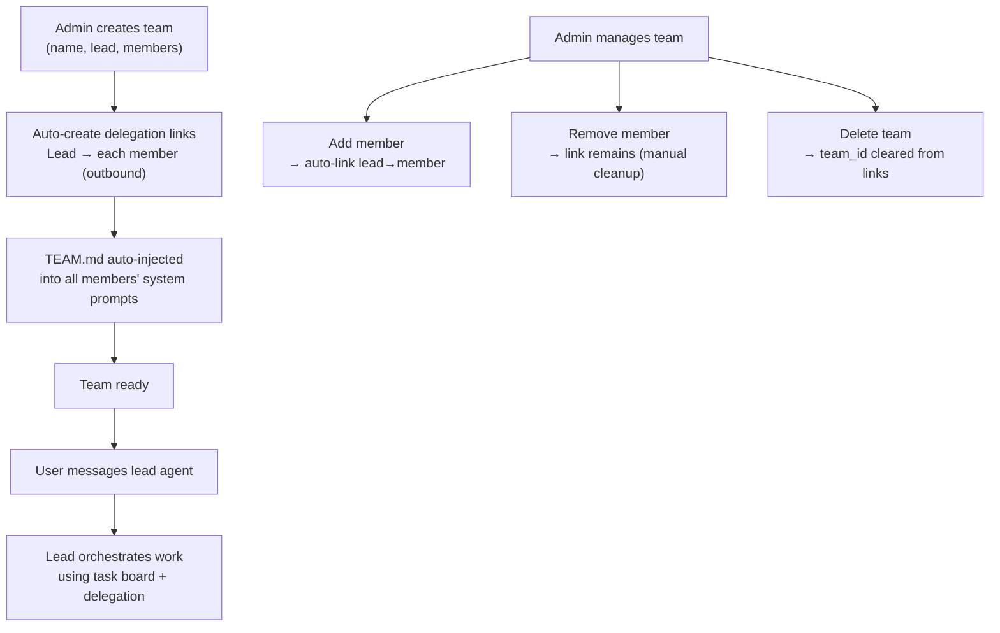
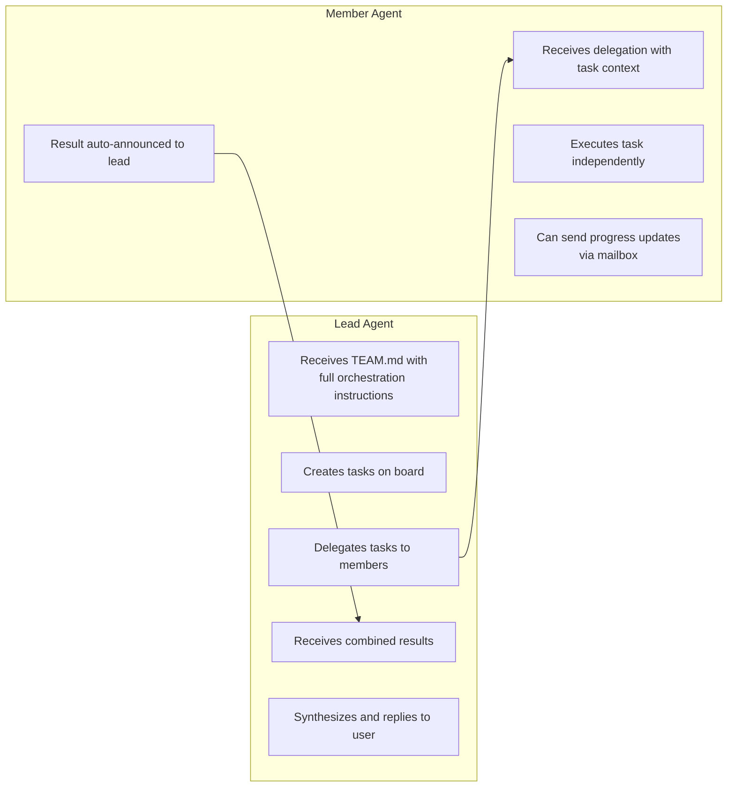
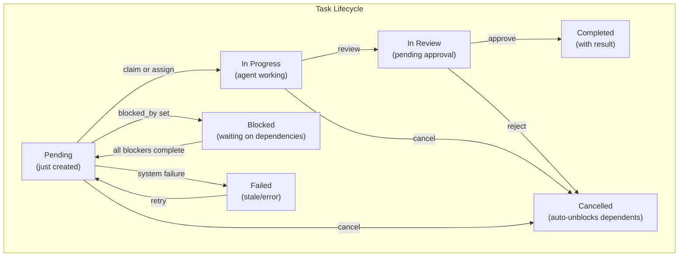
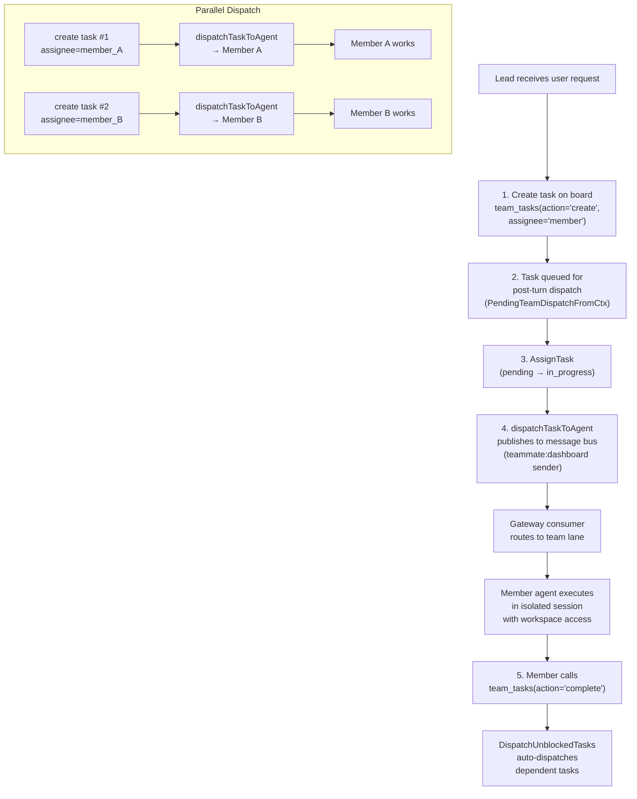
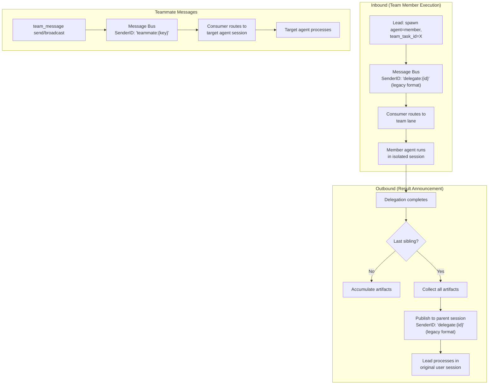

# 11 - Agent Teams

## Overview

Agent teams enable collaborative multi-agent orchestration. A team consists of a **lead** agent and one or more **member** agents. The lead orchestrates work by creating tasks on a shared task board and delegating them to members. Members execute tasks independently and report results back. Communication happens through a built-in mailbox system.

Teams build on top of the delegation system (see [03-tools-system.md](./03-tools-system.md) Section 7) by adding structured coordination: task tracking, parallel work distribution, and result aggregation.

---

## 1. Team Model



### Key Design Principles

- **Lead-centric**: Only the lead receives `TEAM.md` in its system prompt with full orchestration instructions. Members discover context on demand through tools — no wasted tokens on idle agents.
- **Mandatory task tracking**: Every delegation from a lead must be linked to a task on the board. The system enforces this — delegations without a `team_task_id` are rejected.
- **Auto-completion**: When a delegation finishes, its linked task is automatically marked as complete. No manual bookkeeping required.
- **Parallel batching**: When multiple members work simultaneously, results are collected and delivered to the lead in a single combined announcement.

---

## 2. Team Lifecycle



### Creation Process

1. Resolve lead agent by key or UUID
2. Resolve all member agents
3. Create team record with `status=active`
4. Add lead as member with `role=lead`
5. Add each member with `role=member`
6. Auto-create outbound agent links from lead to each member (direction: outbound, max_concurrent: 3, marked with `team_id`)
7. Invalidate agent router caches so TEAM.md is injected on next request

When a member is added later, the same auto-linking happens. Links created by team setup are tagged with `team_id` — this distinguishes them from manually created delegation links.

---

## 3. Lead vs Member Roles

The lead and members have fundamentally different responsibilities and tool access.



### What the Lead Sees (TEAM.md)

The lead's system prompt includes a `TEAM.md` section containing:

- Team name and description
- Complete list of teammates with their roles and expertise (from `frontmatter`)
- **Mandatory workflow instructions**: always create a task first, then delegate with the task ID
- **Orchestration patterns**: sequential (A→B), iterative (A→B→A), parallel (A+B→review), mixed
- **Communication guidelines**: notify user when assigning work, share progress on follow-up rounds

### What Members See (TEAM.md)

Members get a simpler version:

- Team name and teammate list
- Instructions to focus on executing delegated work
- How to send progress updates to the lead via mailbox
- Available task board actions (list, get, search — no create/delegate)

---

## 4. Task Board

The task board is a shared work tracker accessible to all team members via the `team_tasks` tool.



### Actions

| Action | Description | Who Uses It |
|--------|-------------|-------------|
| `create` | Create task with subject, description, priority, assignee, blocked_by | Lead/Admin |
| `claim` | Atomically claim a pending task | Members |
| `complete` | Mark task done with result summary | Members/Agents |
| `approve` | Approve completed task (human-in-the-loop) | Admin/Human |
| `reject` | Reject task with reason, mark as cancelled, inject message to lead | Admin/Human |
| `cancel` | Cancel task with reason | Lead |
| `assign` | Admin-assign a pending task to an agent | Admin |
| `review` | Submit task for review, transitions to in_review status | Members |
| `comment` | Add comment to task | All |
| `progress` | Update task progress (percent, step) | Members |
| `list` | List tasks (filter: active/in_review/completed/all, page) | All |
| `get` | Get full task detail with comments, events, attachments | All |
| `search` | Full-text search over subject + description | All |
| `attach` | Attach workspace file to task | Members |
| `ask_user` | Set periodic reminder sent to user for decision | Members |
| `clear_ask_user` | Cancel a previously set ask_user reminder | Members |
| `retry` | Re-dispatch stale or failed tasks back to pending | Admin |
| `update` | Update task metadata (priority, description, etc.) | Lead |

### Atomic Claiming

Two agents grabbing the same task is prevented at the database level. The claim operation uses a conditional update: `SET status = 'in_progress', owner = agent WHERE status = 'pending' AND owner IS NULL`. One row updated means claimed; zero rows means someone else got it first. No distributed mutex needed.

### Blocker Escalation

Members can flag themselves as blocked on a task by adding a blocker comment:

```
team_tasks(action="comment", task_id="...", text="Cannot find API documentation", type="blocker")
```

When a blocker comment is posted:
1. The comment is saved with `comment_type='blocker'`
2. The task is **auto-failed** (status: in_progress → failed)
3. An `EventTeamTaskFailed` is broadcast:
   - Member's session is cancelled via scheduler
   - Chat channel receives "❌ Task failed" notification
   - Web UI dashboard updates in real-time
4. The **lead agent receives an escalation message** from `system:escalation` with:
   - Blocked member name
   - Task number and subject
   - Blocker reason
   - Instructions to retry with `team_tasks(action="retry", task_id="...")`

Blocker escalation is **enabled by default** but can be disabled per-team via settings:
```json
{
  "blocker_escalation": {
    "enabled": false
  }
}
```

When disabled, blocker comments are saved but do not trigger auto-fail or escalation.

### Task Dependencies & Blocking

Tasks can declare `blocked_by` — a list of prerequisite task IDs. When a task has blocking dependencies:
- Task enters `blocked` status (distinct from `pending`)
- Task remains blocked until ALL prerequisites are completed
- When a blocking task completes, all dependent tasks with now-satisfied blockers automatically transition from `blocked` → `pending`
- Cancelled tasks (via `cancel` or `reject`) also unblock their dependents

The `blocked` status is one of 8 possible statuses: `pending`, `in_progress`, `in_review`, `completed`, `failed`, `cancelled`, `blocked`, `stale`.

### Task Data Model

| Field | Description |
|-------|-------------|
| `id`, `team_id` | Unique ID + team ownership |
| `subject`, `description` | Task title and details |
| `status` | pending, in_progress, in_review, completed, failed, cancelled, blocked, stale |
| `priority` | Integer (higher = more important) |
| `owner_agent_id` | Agent currently working on task |
| `created_by_agent_id` | Agent that created the task (if auto-created by agent) |
| `blocked_by` | List of task IDs this task depends on |
| `task_type` | "general" or custom type label |
| `task_number` | Human-readable sequential number (team-local) |
| `progress_percent`, `progress_step` | Current progress tracking |
| `metadata` | Custom JSON for task snapshots, peer_kind, local_key, team_workspace |
| `user_id`, `chat_id`, `channel` | Scope: which user/group triggered this task |
| `result` | Result summary when completed |

### Task Snapshots

Completed tasks automatically store snapshots in metadata for UI board visualization:

```json
{
  "snapshot": {
    "completed_at": "2026-03-16T12:34:56Z",
    "result_preview": "First 100 chars of result...",
    "final_status": "completed",
    "ai_summary": "Brief AI-generated summary of what was accomplished"
  }
}
```

The board displays these snapshots in a visual timeline, allowing users to review completed work at a glance.

### Delegate Agent Restrictions

Guards that previously prevented delegate agents from directly completing, cancelling, or approving/rejecting tasks are currently commented out (reserved for a future reviewer workflow). At this time, these restrictions are not enforced at runtime. A future implementation may re-enable them when a structured reviewer/approval flow is introduced.

### Assignee is Mandatory

When creating a task via `team_tasks(action="create")`, the `assignee` field is **required**. This specifies which team member should handle the task. If omitted, error: `"assignee is required — specify which team member should handle this task"`

### Concurrent Creation Guard

Agents must check existing tasks before creating new ones. This prevents duplicate task creation in concurrent sessions. The preferred method is `team_tasks(action="search", query="<keywords>")` which uses semantic + keyword matching and saves tokens vs listing all. Alternatively `action="list"` shows the full board. When an agent calls `create` without first checking:
- Error: `"You must check existing tasks first. Call team_tasks(action='search', query='<keywords>') to check for similar tasks before creating — this saves tokens vs listing all."`

### Auto-Claiming Behavior

When an agent calls `complete` on a `pending` task, the task is **automatically claimed first**. This saves an extra tool call:
1. Agent calls `complete` on task in `pending` status
2. System atomically claims the task (pending → in_progress, assign to agent)
3. System marks as `completed`
4. Returns success in one action

This is safe because the claim is atomic — only one agent can succeed.

### User & Channel Scoping

- **System/teammate channels**: See all tasks for the team
- **Regular user channels**: Filter to tasks they triggered (filtered by user ID)
- **Scope discovery**: `teams.scopes` lists all unique channel+chatID scopes across tasks
- **Known users**: `teams.known_users` lists distinct user IDs from team member sessions (UI user select)
- **Pagination**: 30 tasks per page for lists
- **Result truncation**: 8,000 characters for `get`, 500 characters for search snippets

### Comments, Events & Attachments

#### Task Comments

Humans and agents can add comments to provide feedback or clarification:

- `handleTaskComment` (human adds comment via dashboard)
- Comments stored with author ID (agent_id or user_id), creation timestamp
- Emits `EventTeamTaskCommented` event
- Visible in task detail page

#### Task Events

Audit trail of all task state changes:

- Event types: `created`, `assigned`, `completed`, `approved`, `rejected`, `commented`, `failed`, `cancelled`, `stale`, `recovered`
- Each event records actor type (agent or human), actor ID, timestamp, and optional metadata
- Used for compliance audits and UI activity timeline

#### Task Attachments

Workspace files can be attached to tasks:

- Attach action links workspace file (by file ID) to task
- Auto-links files created during task execution
- Metadata captures which agent/user attached the file

### Review Workflow

Tasks can require human approval before final completion. When creating a task, pass `require_approval: true`:

```
team_tasks(action="create", ..., require_approval=true)
```

**Flow:**

1. **Create with approval flag**: Task created with status `pending`, `require_approval` set
2. **Member submits for review**: When done, member calls `team_tasks(action="review", task_id="...")`
   - Task transitions to `in_review` status
   - Emits `EventTeamTaskReviewed` event
3. **Human approves**: Via dashboard, human clicks "Approve" → `teams.tasks.approve` RPC
   - Task transitions to `completed`
   - Emits `EventTeamTaskApproved` event
4. **Human rejects**: Via dashboard, human clicks "Reject" with reason → `teams.tasks.reject` RPC
   - Task transitions to `cancelled` with reason
   - Emits `EventTeamTaskRejected` event
   - Lead receives notification to retry or investigate

Without `require_approval`, tasks move directly to `completed` after member calls `complete` (no in-review stage).

---

## 5. Team Mailbox

The mailbox enables peer-to-peer communication between team members via the `team_message` tool.

| Action | Description |
|--------|-------------|
| `send` | Send a direct message to a specific teammate by agent key |
| `broadcast` | Send a message to all teammates (except self) |
| `read` | Read unread messages, automatically marks them as read |

### Message Format

When a team message is sent, it flows through the message bus with a `"teammate:"` prefix:

```
[Team message from {sender_key}]: {message text}
```

The receiving agent processes this as an inbound message, routed through the team scheduler lane. The response is published back to the originating channel so the user (and lead) can see it.

### Use Cases

- **Lead → Member**: "Please claim a task from the board"
- **Member → Lead**: "Task partially complete, need clarification on requirements"
- **Member → Member**: Cross-coordination between teammates working on related tasks
- **Broadcast**: Lead sharing context updates with all members simultaneously

---

## 6. Team Workspace

Each team has a shared workspace for storing files produced during task execution. Workspace scoping is configurable per team.

### Workspace Modes

| Mode | Directory Structure | Use Case |
|------|-------------------|----------|
| **Isolated** (default) | `{dataDir}/teams/{teamID}/{chatID}/` | Per-conversation file isolation; each user/chat has own folder |
| **Shared** | `{dataDir}/teams/{teamID}/` | All team members access same folder; no user/chat isolation |

Configure via team settings `workspace_scope: "shared"` (default: `"isolated"`).

### Workspace Access

Team members have file tools access to their team workspace:

- **Read**: List files, read file content
- **Write**: Create and update files (auto-linked to task)
- **Delete**: Remove files from workspace

When a member writes a file during task execution, it's automatically:
1. Stored in team workspace with metadata
2. Linked to the active task (task_id)
3. Visible to other team members on task detail page

### WorkspaceDir Context

During task dispatch, the team workspace directory is injected into tool context:

```go
WithToolTeamWorkspace(ctx, "/path/to/teams/{teamID}/")
WithToolTeamID(ctx, "{teamID}")
WithTeamTaskID(ctx, "{taskID}")
WithWorkspaceChannel(ctx, task.Channel)
WithWorkspaceChatID(ctx, task.ChatID)
```

File tools use this context to resolve workspace paths and auto-link files to tasks.

### Quota & Limits

| Limit | Value |
|-------|-------|
| Max file size | 10 MB |
| Max files per scope | 100 |
| Directory creation | Automatic (0750 permissions) |

---

## 7. Task Dispatch Integration

Teams use a task-board-driven dispatch model. The lead creates tasks with an assignee; the system auto-dispatches to the assigned member agent via the message bus. The legacy `spawn(agent=..., team_task_id=...)` flow has been removed — `spawn` now only supports self-clone subagents.



### Dispatch Mechanism

Task dispatch uses `dispatchTaskToAgent()` (`team_tool_dispatch.go`) which publishes an inbound message via the message bus:

- **Post-turn dispatch** (default): Tasks created during a lead's turn are queued via `PendingTeamDispatchFromCtx` and dispatched after the turn ends. This avoids race conditions with `blocked_by` setup.
- **Fallback dispatch**: If no post-turn hook is available (e.g., HTTP API context), the task is assigned and dispatched immediately.
- **Routing**: Uses `task.Channel`/`task.ChatID` as primary source, falling back to context values for initial dispatch.

### Spawn Rejection

The `spawn` tool no longer accepts an `agent` parameter. If an LLM attempts `spawn(agent="member")`, it receives an error directing it to use `team_tasks(action="create", assignee="member")` instead.

### Dispatch Safety

- **Lead self-dispatch guard**: Tasks assigned to the lead agent are auto-failed (prevents dual-session loop).
- **Circuit breaker**: Tasks auto-fail after 3 dispatch attempts (`maxTaskDispatches`). Prevents infinite loops when agents can't complete a task.
- **Dispatch count tracking**: Each dispatch increments `metadata.dispatch_count`.

### Auto-Completion

When a member calls `team_tasks(action="complete")`:

1. Task marked as `completed` with result summary
2. Files created during execution are auto-linked to the task
3. Workspace events recorded (modified/created file events)
4. `DispatchUnblockedTasks` runs — pending tasks with satisfied blockers are auto-dispatched
5. Only one task per owner dispatched per round (priority-ordered) to prevent cancellation bugs

### Unblocked Task Dispatch

`DispatchUnblockedTasks()` runs after task completion/cancellation:

- Finds pending tasks with assigned owners (ordered by priority DESC)
- Dispatches highest-priority task per owner (one at a time)
- Appends completed blocker results and recent comments to dispatch content
- Restores leader's trace context from task metadata for proper trace linking
- Remaining tasks stay pending until the current one completes

### Dispatch Content

Each dispatched task includes in its message to the member:

- Task number, ID, subject, and description
- Team workspace path (if configured)
- List of attached files (from task metadata)
- Instructions for available actions: progress, comment, blocker, complete
- Completed blocker results (for unblocked tasks)
- Recent comments (for re-dispatched tasks after reject/retry)

---

## 8. TEAM.md — System-Injected Context

`TEAM.md` is a virtual file generated at agent resolution time. It is not stored on disk or in the database — it's rendered dynamically based on the current team configuration and injected into the system prompt wrapped in `<system_context>` tags.

### Generation Trigger

During agent resolution, if the agent belongs to a team:
1. Load team data
2. Load team members
3. Generate TEAM.md with role-appropriate content
4. Inject as a context file

### Content Differences

| Section | Lead | Member |
|---------|------|--------|
| Team name + description | Yes | Yes |
| Teammate list with roles | Yes | Yes |
| Mandatory workflow (create→delegate) | Yes | No |
| Orchestration patterns | Yes | No |
| Communication guidelines | Yes | No |
| Task board actions (full) | Yes | Limited |
| "Just do the work" instructions | No | Yes |
| Progress update guidance | No | Yes |

### Orchestration Patterns (Lead Only)

The lead's TEAM.md describes three orchestration patterns:

- **Sequential**: Member A finishes → lead reviews → delegates to Member B with A's output
- **Iterative**: Member A drafts → Member B reviews → back to A with feedback
- **Mixed**: Members A+B work in parallel → lead reviews combined output → delegates to C

### Negative Context Injection

If an agent is NOT part of any team AND has no delegation targets, the system injects negative context:
- "You are NOT part of any team. Do not use team_tasks or team_message tools."
- "You have NO delegation targets. Do not use spawn with agent parameter."

This prevents wasted LLM iterations probing unavailable capabilities.

---

## 9. Message Routing

Team messages flow through the message bus with specific routing rules.



### Routing Prefixes

| Prefix | Source | Destination | Scheduler Lane |
|--------|--------|-------------|----------------|
| `delegate:` | Delegation completion (legacy session key format) | Parent agent's original session | team |
| `teammate:` | Team mailbox message | Target agent's session | team |

### Session Context Preservation

When a delegation or team message completes, the result is routed back to the **original user session** (not a new session). This is achieved through metadata propagation:

- `origin_channel`: The channel where the user sent the message (e.g., telegram)
- `origin_peer_kind`: DM or group context
- `origin_local_key`: Thread/topic context for correct routing (e.g., forum topic ID)

This ensures results land in the correct conversation thread, even in Telegram forum topics or Feishu thread discussions.

---

## 10. Access Control

Teams support fine-grained access control through team settings.

### Team-Level Settings

| Setting | Type | Description |
|---------|------|-------------|
| `allow_user_ids` | String list | Only these users can trigger team work |
| `deny_user_ids` | String list | These users are blocked (deny takes priority) |
| `allow_channels` | String list | Only messages from these channels trigger team work |
| `deny_channels` | String list | Block messages from these channels |
| `workspace_scope` | String | "isolated" (default) or "shared" — file scope mode |
| `workspace_quota_mb` | Integer | Max workspace size in MB (optional) |
| `progress_notifications` | Boolean | Emit progress_notification events |
| `followup_interval_minutes` | Integer | Ask_user reminder interval |
| `followup_max_reminders` | Integer | Max ask_user reminders before escalation |
| `escalation_mode` | String | How to escalate stale tasks: "notify_lead", "fail_task" |
| `escalation_actions` | String list | Actions to take on escalation |
| `blocker_escalation` | Object | Blocker comment escalation settings: `{enabled: true}` (default enabled) |

System channels (`teammate`, `system`) always pass access checks. Empty settings mean open access.

### Link-Level Settings

Each delegation link (lead→member) has its own settings:

| Setting | Description |
|---------|-------------|
| `UserAllow` | Only these users can trigger this specific delegation |
| `UserDeny` | Block these users from this delegation (deny takes priority) |

### Concurrency Limits

| Layer | Scope | Default |
|-------|-------|---------|
| Per-link | Simultaneous delegations from lead to a specific member | 3 |
| Per-agent | Total concurrent delegations targeting any single member | 5 |

When limits are hit, the error message is written for LLM reasoning: "Agent at capacity (5/5). Try a different agent or handle it yourself."

---

## 11. Delegation Context

### SenderID Clearing

In sync delegations, the delegate agent's context has the `senderID` cleared. This is critical because delegations are system-initiated — the delegate should not inherit the caller's group writer permissions, which would incorrectly deny file writes. Each delegate agent has its own writer list.

### Trace Linking

Delegation traces are linked to the parent trace through `parent_trace_id`. This allows the tracing system to show the full delegation chain: user request → lead processing → member delegation → member execution.

### Workspace & Task Context

Delegation context includes team workspace and task information so member agents can:

1. Access the team workspace directory (if configured)
2. Auto-link files created to the active task
3. Record task progress and comments
4. Route results back to the correct user/chat

Context keys injected:

- `tool_team_id`: Team UUID for team_tasks/team_message tools
- `tool_team_workspace`: Shared workspace directory path (or empty for isolated mode)
- `tool_team_task_id`: Active task UUID for workspace file linking
- `tool_workspace_channel`: Task's origin channel (for routing)
- `tool_workspace_chat_id`: Task's origin chat ID (for routing)

---

## 12. Events

Teams emit events for real-time UI updates and observability.

| Event | When |
|-------|------|
| `team_task.created` | New task added to board |
| `team_task.assigned` | Task assigned to agent (admin or auto-assign) |
| `team_task.completed` | Task marked as complete |
| `team_task.approved` | Task approved by human (human-in-the-loop) |
| `team_task.rejected` | Task rejected, returned to in_progress |
| `team_task.commented` | Comment added by human |
| `team_task.deleted` | Task hard-deleted (terminal status only) |
| `team_updated` | Team settings updated |
| `team_deleted` | Team deleted |
| `delegation.started` | Async delegation begins |
| `delegation.completed` | Delegation finishes successfully |
| `delegation.failed` | Delegation fails |
| `delegation.cancelled` | Delegation cancelled |
| `team_message.sent` | Mailbox message delivered |

---

## File Reference

| File | Purpose |
|------|---------|
| `internal/gateway/methods/teams_crud.go` | Team CRUD RPC: Get, Delete, Update settings, TaskList, KnownUsers, Scopes, Events |
| `internal/gateway/methods/teams_tasks.go` | Task board RPC: Get, Create, Assign, Comment, Comments, Events, Approve, Reject, Delete, TaskDispatch |
| `internal/gateway/methods/teams_workspace.go` | Workspace RPC: List, Read, Delete (with shared/isolated mode logic) |
| `internal/tools/team_tool_manager.go` | Shared backend for team tools, team cache (5-min TTL), team resolution |
| `internal/tools/team_tasks_tool.go` | Task board tool: list, get, create, claim, complete, cancel, search, approve, reject, comment, progress, attach, ask_user, update |
| `internal/tools/team_message_tool.go` | Mailbox tool: send, broadcast, read, message routing via bus |
| `internal/tools/team_access_policy.go` | Access control: checkTeamAccess validates user/channel against settings |
| `internal/tools/subagent_spawn_tool.go` | Subagent spawning: sync/async delegation, team task enforcement |
| `internal/tools/subagent_exec.go` | Delegation execution, artifact accumulation, session cleanup |
| `internal/tools/subagent_config.go` | Delegation configuration and concurrency control |
| `internal/tools/subagent_tracing.go` | Delegation tracing and event broadcasting |
| `internal/tools/workspace_dir.go` | WorkspaceDir helper, shared/isolated mode detection, file limits |
| `internal/tools/context_keys.go` | Tool context injection: team_id, team_workspace, team_task_id, workspace channel/chatid |
| `internal/agent/resolver.go` | TEAM.md generation (buildTeamMD), injection during agent resolution |
| `internal/agent/systemprompt_sections.go` | TEAM.md rendering in system prompt as `<system_context>` |
| `internal/store/team_store.go` | TeamStore interface (~40 methods), data types: TeamData, TeamTaskData, TeamMessageData, TeamTaskCommentData, etc. |
| `internal/store/pg/teams.go` | PostgreSQL implementation: teams CRUD, members, tasks, messages, events, attachments |
| `cmd/gateway_managed.go` | Team tool wiring, cache invalidation subscription |
| `cmd/gateway_consumer.go` | Message routing for teammate/delegate (legacy) prefixes, task dispatch to agents |

---

## Cross-References

| Document | Relevant Content |
|----------|-----------------|
| [03-tools-system.md](./03-tools-system.md) | Delegation system, agent links |
| [06-store-data-model.md](./06-store-data-model.md) | Team tables schema, delegation_history |
| [08-scheduling-cron.md](./08-scheduling-cron.md) | Delegate scheduler lane (concurrency 100), cron |
| [09-security.md](./09-security.md) | Delegation security |
