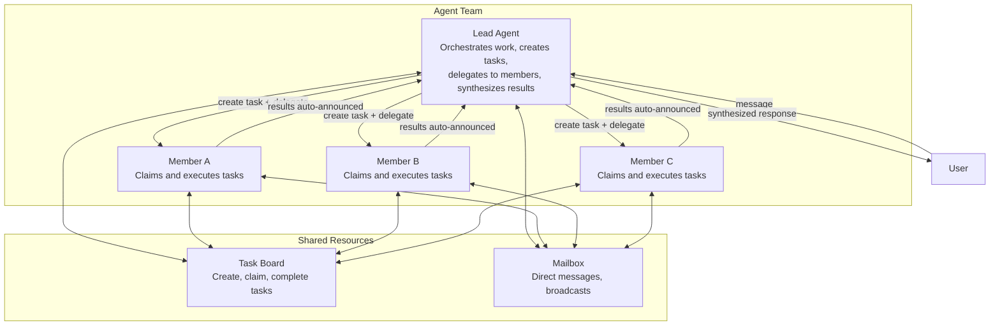
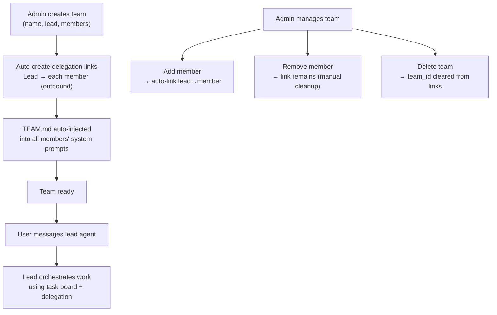
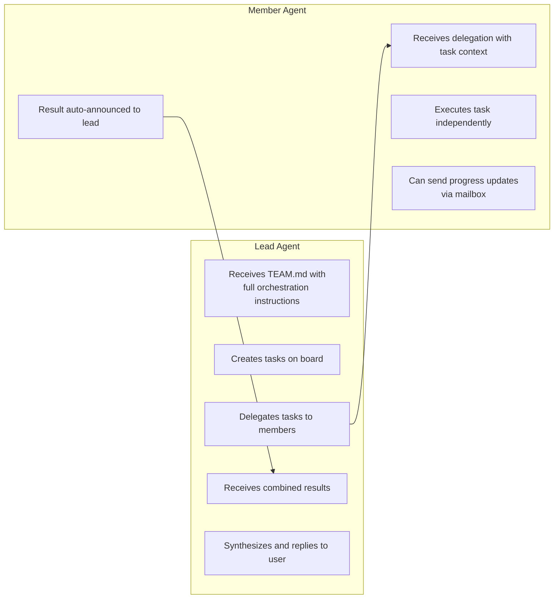
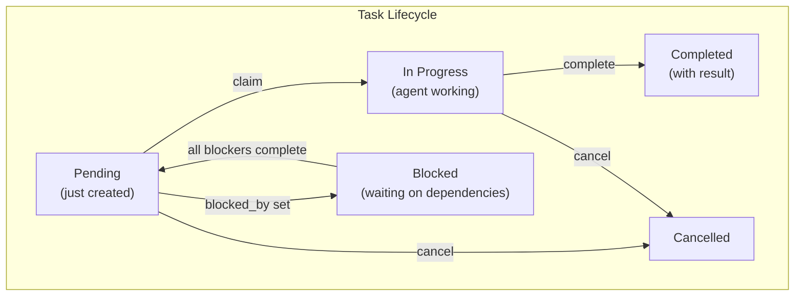
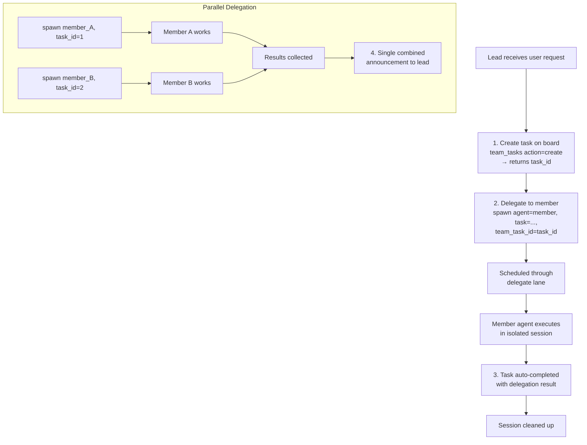
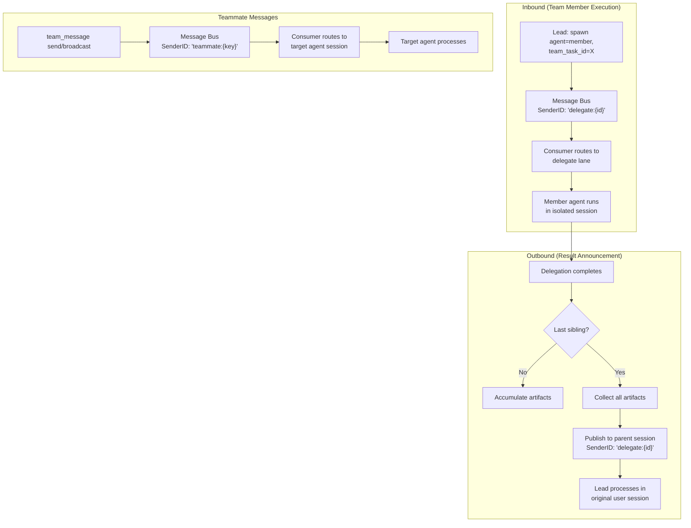

# 11 - Agent Teams

## Overview

Agent teams enable collaborative multi-agent orchestration. A team consists of a **lead** agent and one or more **member** agents. The lead orchestrates work by creating tasks on a shared task board and delegating them to members. Members execute tasks independently and report results back. Communication happens through a built-in mailbox system.

Teams build on top of the delegation system (see [03-tools-system.md](./03-tools-system.md) Section 7) by adding structured coordination: task tracking, parallel work distribution, and result aggregation.

---

## 1. Team Model



### Key Design Principles

- **Lead-centric**: Only the lead receives `TEAM.md` in its system prompt with full orchestration instructions. Members discover context on demand through tools — no wasted tokens on idle agents.
- **Mandatory task tracking**: Every delegation from a lead must be linked to a task on the board. The system enforces this — delegations without a `team_task_id` are rejected.
- **Auto-completion**: When a delegation finishes, its linked task is automatically marked as complete. No manual bookkeeping required.
- **Parallel batching**: When multiple members work simultaneously, results are collected and delivered to the lead in a single combined announcement.

---

## 2. Team Lifecycle



### Creation Process

1. Resolve lead agent by key or UUID
2. Resolve all member agents
3. Create team record with `status=active`
4. Add lead as member with `role=lead`
5. Add each member with `role=member`
6. Auto-create outbound agent links from lead to each member (direction: outbound, max_concurrent: 3, marked with `team_id`)
7. Invalidate agent router caches so TEAM.md is injected on next request

When a member is added later, the same auto-linking happens. Links created by team setup are tagged with `team_id` — this distinguishes them from manually created delegation links.

---

## 3. Lead vs Member Roles

The lead and members have fundamentally different responsibilities and tool access.



### What the Lead Sees (TEAM.md)

The lead's system prompt includes a `TEAM.md` section containing:

- Team name and description
- Complete list of teammates with their roles and expertise (from `frontmatter`)
- **Mandatory workflow instructions**: always create a task first, then delegate with the task ID
- **Orchestration patterns**: sequential (A→B), iterative (A→B→A), parallel (A+B→review), mixed
- **Communication guidelines**: notify user when assigning work, share progress on follow-up rounds

### What Members See (TEAM.md)

Members get a simpler version:

- Team name and teammate list
- Instructions to focus on executing delegated work
- How to send progress updates to the lead via mailbox
- Available task board actions (list, get, search — no create/delegate)

---

## 4. Task Board

The task board is a shared work tracker accessible to all team members via the `team_tasks` tool.



### Actions

| Action | Description | Who Uses It |
|--------|-------------|-------------|
| `create` | Create task with subject, description, priority, blocked_by | Lead |
| `claim` | Atomically claim a pending task | Members (or auto-claimed by delegation) |
| `complete` | Mark task done with a result summary | Members (or auto-completed by delegation) |
| `cancel` | Cancel a task with a reason | Lead |
| `list` | List tasks (filter: active/completed/all, order: priority/newest) | All |
| `get` | Get full task detail including result | All |
| `search` | Full-text search over subject + description | All |

### Atomic Claiming

Two agents grabbing the same task is prevented at the database level. The claim operation uses a conditional update: `SET status = 'in_progress', owner = agent WHERE status = 'pending' AND owner IS NULL`. One row updated means claimed; zero rows means someone else got it first. No distributed mutex needed.

### Task Dependencies

Tasks can declare `blocked_by` — a list of prerequisite task IDs. A blocked task stays in `blocked` status until all its prerequisites are completed. When a task is completed via `complete`, all dependent tasks whose blockers are now all done automatically transition from `blocked` to `pending`.

### User Scoping

- Delegate and system channels see all tasks for the team
- End users see only tasks they triggered (filtered by user ID)
- List pagination: 20 tasks per page
- Result truncation: 8,000 characters for `get`, 500 characters for search snippets

---

## 5. Team Mailbox

The mailbox enables peer-to-peer communication between team members via the `team_message` tool.

| Action | Description |
|--------|-------------|
| `send` | Send a direct message to a specific teammate by agent key |
| `broadcast` | Send a message to all teammates (except self) |
| `read` | Read unread messages, automatically marks them as read |

### Message Format

When a team message is sent, it flows through the message bus with a `"teammate:"` prefix:

```
[Team message from {sender_key}]: {message text}
```

The receiving agent processes this as an inbound message, routed through the delegate scheduler lane. The response is published back to the originating channel so the user (and lead) can see it.

### Use Cases

- **Lead → Member**: "Please claim a task from the board"
- **Member → Lead**: "Task partially complete, need clarification on requirements"
- **Member → Member**: Cross-coordination between teammates working on related tasks
- **Broadcast**: Lead sharing context updates with all members simultaneously

---

## 6. Delegation Integration

Teams integrate deeply with the delegation system. The mandatory workflow ensures every piece of delegated work is tracked.



### Task ID Enforcement

When a team member delegates work, the system requires a valid `team_task_id`:

- **Missing task ID**: Delegation is rejected with an error explaining the requirement. The error includes a list of pending tasks to help the LLM self-correct.
- **Invalid task ID**: If the LLM hallucinates a UUID that doesn't exist, the error includes pending tasks as a hint.
- **Cross-team task ID**: If the task belongs to a different team, the delegation is rejected.
- **Auto-claim**: When delegation starts, the linked task is automatically claimed (status: pending → in_progress).

### Auto-Completion

When a delegation finishes (success or failure):

1. The linked task is marked as `completed` with the delegation result
2. A team message audit record is created (from member → lead)
3. The delegation session is cleaned up (deleted)
4. Delegation history is saved with team context (team_id, team_task_id, trace_id)

### Parallel Delegation Batching

When the lead delegates to multiple members simultaneously:

- Each delegation runs independently in the delegate lane
- Intermediate completions accumulate their results (artifacts)
- When the **last** sibling delegation finishes, all accumulated results are collected
- A single combined announcement is delivered to the lead with all results
- Each individual task is still auto-completed independently — the batching only affects the announcement

### Announcement Format

The combined announcement includes:

- Results from each member agent, separated clearly
- Deliverables and media files (auto-delivered)
- Elapsed time statistics
- Guidance for the lead: present results to user, delegate follow-ups, or ask for revisions

If all delegations failed, the lead receives a friendly error notification with guidance to retry or handle it directly. The announcement also asks the lead to notify the user of the hiccup before retrying.

---

## 7. TEAM.md — System-Injected Context

`TEAM.md` is a virtual file generated at agent resolution time. It is not stored on disk or in the database — it's rendered dynamically based on the current team configuration and injected into the system prompt wrapped in `<system_context>` tags.

### Generation Trigger

During agent resolution, if the agent belongs to a team:
1. Load team data
2. Load team members
3. Generate TEAM.md with role-appropriate content
4. Inject as a context file

### Content Differences

| Section | Lead | Member |
|---------|------|--------|
| Team name + description | Yes | Yes |
| Teammate list with roles | Yes | Yes |
| Mandatory workflow (create→delegate) | Yes | No |
| Orchestration patterns | Yes | No |
| Communication guidelines | Yes | No |
| Task board actions (full) | Yes | Limited |
| "Just do the work" instructions | No | Yes |
| Progress update guidance | No | Yes |

### Orchestration Patterns (Lead Only)

The lead's TEAM.md describes three orchestration patterns:

- **Sequential**: Member A finishes → lead reviews → delegates to Member B with A's output
- **Iterative**: Member A drafts → Member B reviews → back to A with feedback
- **Mixed**: Members A+B work in parallel → lead reviews combined output → delegates to C

### Negative Context Injection

If an agent is NOT part of any team AND has no delegation targets, the system injects negative context:
- "You are NOT part of any team. Do not use team_tasks or team_message tools."
- "You have NO delegation targets. Do not use spawn with agent parameter."

This prevents wasted LLM iterations probing unavailable capabilities.

---

## 8. Message Routing

Team messages flow through the message bus with specific routing rules.



### Routing Prefixes

| Prefix | Source | Destination | Scheduler Lane |
|--------|--------|-------------|----------------|
| `delegate:` | Delegation completion | Parent agent's original session | delegate |
| `teammate:` | Team mailbox message | Target agent's session | delegate |

### Session Context Preservation

When a delegation or team message completes, the result is routed back to the **original user session** (not a new session). This is achieved through metadata propagation:

- `origin_channel`: The channel where the user sent the message (e.g., telegram)
- `origin_peer_kind`: DM or group context
- `origin_local_key`: Thread/topic context for correct routing (e.g., forum topic ID)

This ensures results land in the correct conversation thread, even in Telegram forum topics or Feishu thread discussions.

---

## 9. Access Control

Teams support fine-grained access control through team settings.

### Team-Level Settings

| Setting | Type | Description |
|---------|------|-------------|
| `AllowUserIDs` | String list | Only these users can trigger team work |
| `DenyUserIDs` | String list | These users are blocked (deny takes priority) |
| `AllowChannels` | String list | Only messages from these channels trigger team work |
| `DenyChannels` | String list | Block messages from these channels |

System channels (`delegate`, `system`) always pass access checks. Empty settings mean open access.

### Link-Level Settings

Each delegation link (lead→member) has its own settings:

| Setting | Description |
|---------|-------------|
| `UserAllow` | Only these users can trigger this specific delegation |
| `UserDeny` | Block these users from this delegation (deny takes priority) |

### Concurrency Limits

| Layer | Scope | Default |
|-------|-------|---------|
| Per-link | Simultaneous delegations from lead to a specific member | 3 |
| Per-agent | Total concurrent delegations targeting any single member | 5 |

When limits are hit, the error message is written for LLM reasoning: "Agent at capacity (5/5). Try a different agent or handle it yourself."

---

## 10. Delegation Context

### SenderID Clearing

In sync delegations, the delegate agent's context has the `senderID` cleared. This is critical because delegations are system-initiated — the delegate should not inherit the caller's group writer permissions, which would incorrectly deny file writes. Each delegate agent has its own writer list.

### Trace Linking

Delegation traces are linked to the parent trace through `parent_trace_id`. This allows the tracing system to show the full delegation chain: user request → lead processing → member delegation → member execution.

---

## 11. Events

Teams emit events for real-time UI updates and observability.

| Event | When |
|-------|------|
| `delegation.started` | Async delegation begins |
| `delegation.completed` | Delegation finishes successfully |
| `delegation.failed` | Delegation fails |
| `delegation.cancelled` | Delegation cancelled |
| `team_task.created` | New task added to board |
| `team_task.completed` | Task marked as complete |
| `team_message.sent` | Mailbox message delivered |

---

## File Reference

| File | Purpose |
|------|---------|
| `internal/gateway/methods/teams.go` | Team CRUD RPC handlers, auto-link creation on team create/member add |
| `internal/tools/team_tool_manager.go` | Shared backend for team tools, team cache (5-min TTL), team resolution |
| `internal/tools/team_tasks_tool.go` | Task board tool: list, get, create, claim, complete, cancel, search |
| `internal/tools/team_message_tool.go` | Mailbox tool: send, broadcast, read, message routing via bus |
| `internal/tools/delegate.go` | DelegateManager: sync/async delegation, team task enforcement, auto-completion |
| `internal/tools/delegate_state.go` | Active delegation tracking, artifact accumulation, session cleanup |
| `internal/tools/delegate_policy.go` | Access control: user permissions, team access, concurrency checks |
| `internal/tools/delegate_events.go` | Delegation event broadcasting |
| `internal/agent/resolver.go` | TEAM.md generation (buildTeamMD), injection during agent resolution |
| `internal/agent/systemprompt_sections.go` | TEAM.md rendering in system prompt as `<system_context>` |
| `internal/store/team_store.go` | TeamStore interface (22 methods), data types |
| `internal/store/pg/teams.go` | PostgreSQL implementation: teams, tasks, messages, handoff routes |
| `cmd/gateway_managed.go` | Team tool wiring, cache invalidation subscription |
| `cmd/gateway_consumer.go` | Message routing for delegate/teammate prefixes |

---

## Cross-References

| Document | Relevant Content |
|----------|-----------------|
| [03-tools-system.md](./03-tools-system.md) | Delegation system, agent links, quality gates, evaluate loop |
| [06-store-data-model.md](./06-store-data-model.md) | Team tables schema, delegation_history, handoff_routes |
| [08-scheduling-cron-heartbeat.md](./08-scheduling-cron-heartbeat.md) | Delegate scheduler lane (concurrency 100) |
| [09-security.md](./09-security.md) | Delegation security, hook recursion prevention |
