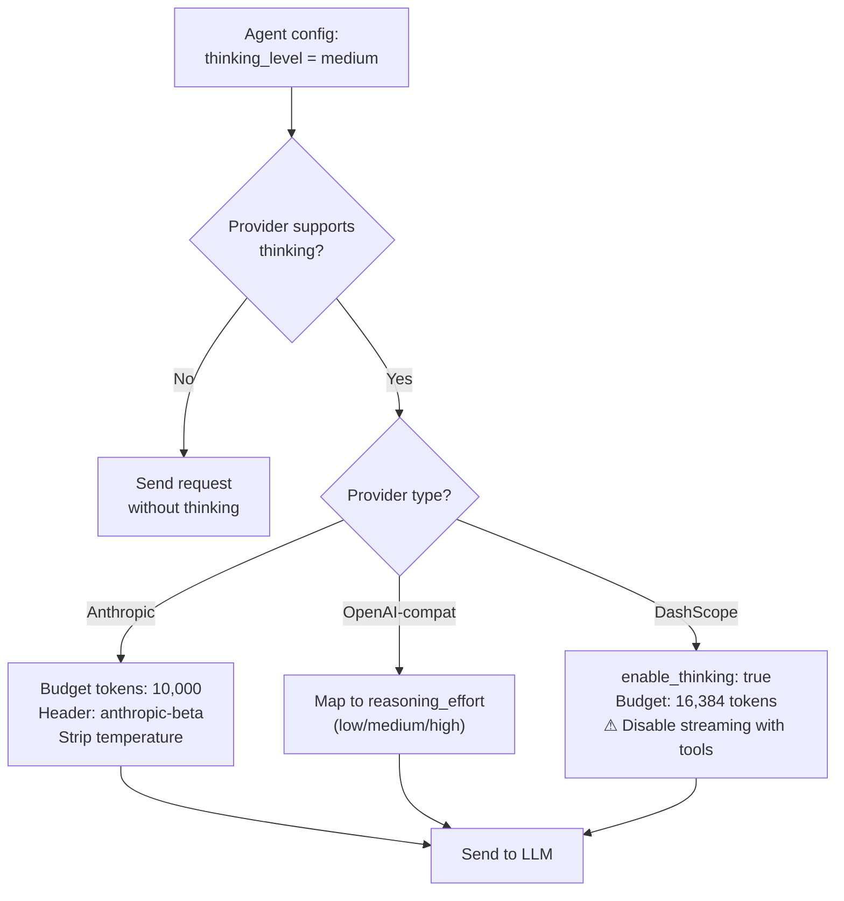
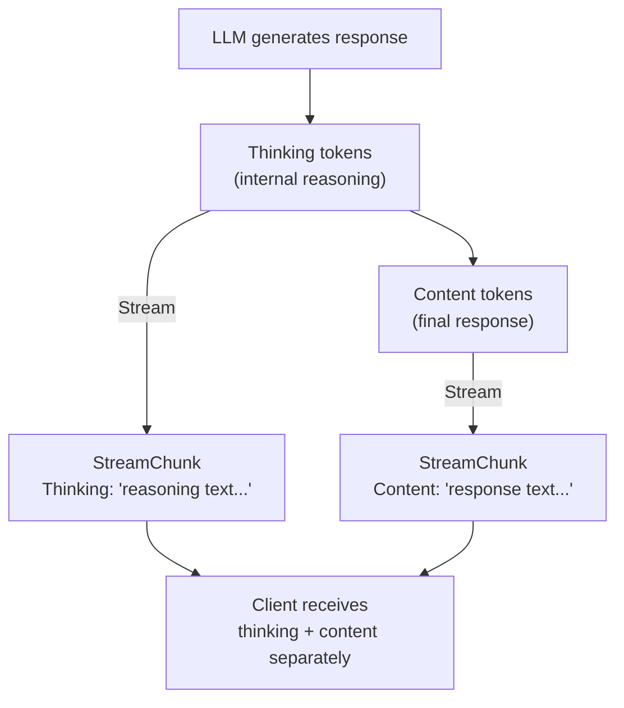
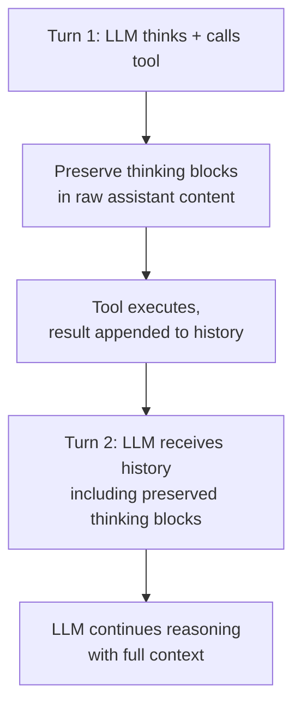

# 12 - Extended Thinking

## Overview

Extended thinking allows LLM providers to "think out loud" before producing a final response. When enabled, the model generates internal reasoning tokens that improve response quality for complex tasks — at the cost of additional token usage and latency. GoClaw supports extended thinking across multiple providers with a unified `thinking_level` configuration.

---

## 1. Configuration

Thinking is controlled per-agent through the `thinking_level` setting.

| Level | Behavior |
|-------|----------|
| `off` | Thinking disabled (default) |
| `low` | Minimal thinking — quick reasoning |
| `medium` | Moderate thinking — balanced reasoning |
| `high` | Maximum thinking — deep reasoning for complex tasks |

The setting can be configured:
- **Per-agent**: In the agent's configuration (applies to all users of that agent)
- **Per-user override**: Via `user_agent_overrides` table (reserved for future use)

---

## 2. Provider Support

Each provider maps the abstract `thinking_level` to its own implementation parameters.

### Anthropic (Native)

| Thinking Level | Budget Tokens |
|:-:|:-:|
| low | 4,096 |
| medium | 10,000 |
| high | 32,000 |

When thinking is enabled:
- Adds `thinking: {type: "enabled", budget_tokens: N}` to the request body
- Sets `anthropic-beta: interleaved-thinking-2025-05-14` header
- Strips `temperature` parameter (Anthropic requirement — cannot use temperature with thinking)
- Auto-adjusts `max_tokens` to accommodate thinking budget (budget + 8,192 buffer)

### OpenAI-Compatible (OpenAI, Groq, DeepSeek, etc.)

Maps `thinking_level` directly to `reasoning_effort`:
- `low` → `reasoning_effort: "low"`
- `medium` → `reasoning_effort: "medium"`
- `high` → `reasoning_effort: "high"`

Reasoning content is returned in the `reasoning_content` field of the response delta during streaming.

### DashScope (Alibaba Qwen)

| Thinking Level | Budget Tokens |
|:-:|:-:|
| low | 4,096 |
| medium | 16,384 |
| high | 32,768 |

Enables thinking via `enable_thinking: true` plus a `thinking_budget` parameter.

**Important limitation**: DashScope does not support streaming when tools are present. When an agent has tools enabled and thinking is active, the provider automatically falls back to non-streaming mode (single `Chat()` call) and synthesizes chunk callbacks to maintain the event flow.

---

## 3. Streaming

When thinking is active, reasoning content streams to the client alongside regular content.

### Provider-Specific Streaming Events

| Provider | Thinking Event | Content Event |
|----------|---------------|---------------|
| Anthropic | `thinking_delta` in content blocks | `text_delta` in content blocks |
| OpenAI-compat | `reasoning_content` in delta | `content` in delta |
| DashScope | No streaming with tools (falls back to non-streaming) | Same |

### Token Estimation

Thinking tokens are estimated as `character_count / 4` for context window tracking. This rough estimate ensures the agent loop can account for thinking overhead when calculating context usage.

---

## 4. Tool Loop Handling

Extended thinking interacts with multi-turn tool conversations. When the LLM calls a tool and then needs to continue reasoning, thinking blocks must be preserved correctly across turns.

### Anthropic Thinking Block Preservation

Anthropic requires thinking blocks (including their cryptographic signatures) to be echoed back in subsequent turns. GoClaw handles this through `RawAssistantContent`:

1. During streaming, raw content blocks are accumulated — including `thinking` type blocks with their `signature` fields
2. When the assistant message is appended to history, the raw blocks are preserved
3. On the next LLM call, these blocks are sent back as-is, ensuring the API can validate thinking continuity

This is critical for correctness: if thinking blocks are dropped or modified, the Anthropic API may reject the request or produce degraded responses.

### Other Providers

OpenAI-compatible providers handle thinking/reasoning content as metadata. The `reasoning_content` is accumulated during streaming but does not require special passback handling — each turn's reasoning is independent.

---

## 5. Limitations

| Provider | Limitation |
|----------|-----------|
| DashScope | Cannot stream when tools are present — falls back to non-streaming mode |
| Anthropic | Temperature parameter stripped when thinking is enabled |
| All | Thinking tokens count against the context window budget |
| All | Thinking increases latency and cost proportional to the budget level |

---

## File Reference

| File | Purpose |
|------|---------|
| `internal/providers/types.go` | ThinkingCapable interface, StreamChunk.Thinking field, OptThinkingLevel constant |
| `internal/providers/anthropic.go` | Anthropic thinking implementation: budget mapping, header injection, temperature stripping |
| `internal/providers/anthropic_stream.go` | Streaming: thinking_delta handling, RawAssistantContent accumulation |
| `internal/providers/anthropic_request.go` | Request building: thinking block preservation for tool loops |
| `internal/providers/openai.go` | OpenAI-compat: reasoning_effort mapping, reasoning_content streaming |
| `internal/providers/dashscope.go` | DashScope: thinking budget, tools+streaming limitation fallback |

---

## Cross-References

| Document | Relevant Content |
|----------|-----------------|
| [02-providers.md](./02-providers.md) | Provider architecture, supported providers |
| [01-agent-loop.md](./01-agent-loop.md) | LLM iteration loop, streaming chunk handling |
